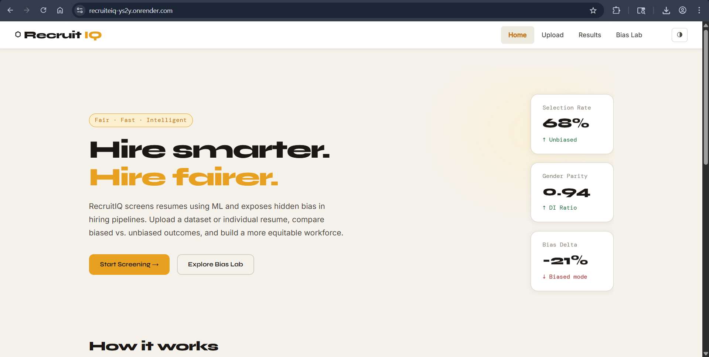
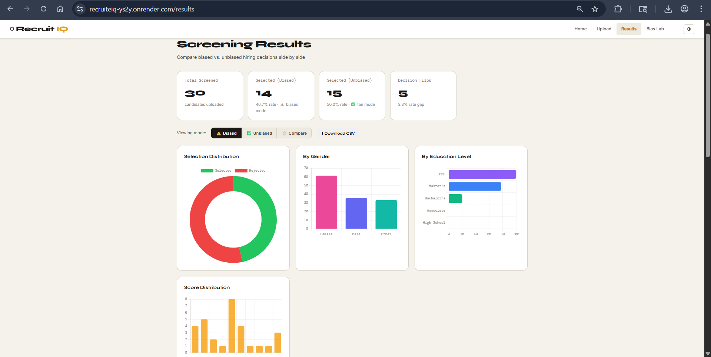
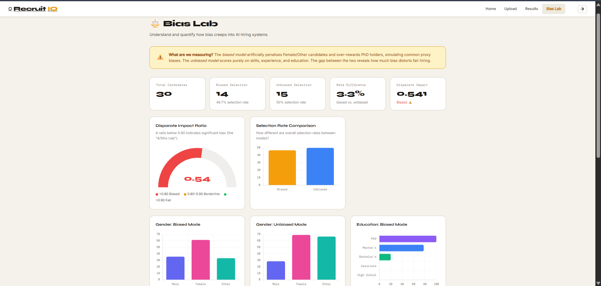
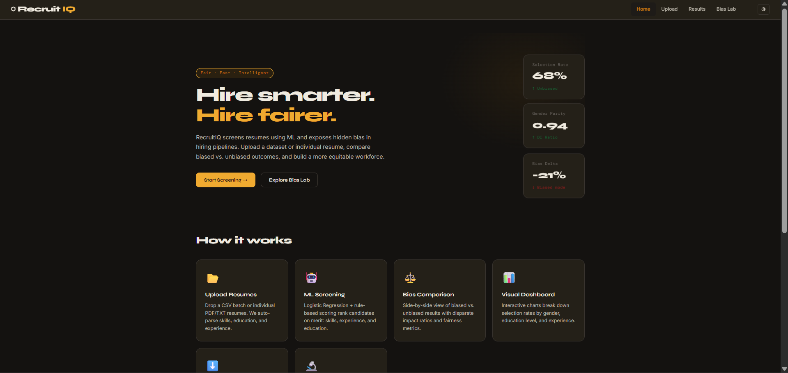

<div align="center">

# ⬡ RecruitIQ

### AI-Powered Resume Screening with Algorithmic Fairness Auditing

*Screens candidates. Detects bias. Proves it with data.*

---

[](https://python.org)
[](https://flask.palletsprojects.com)
[](https://scikit-learn.org)
[](https://chartjs.org)
[](https://recruitiq.onrender.com)
[](LICENSE)

<br/>

## 🌐 [Live Demo](https://recruiteiq-ys2y.onrender.com) &nbsp;|&nbsp; 📄 [Research Paper](docs/research_paper.pdf) &nbsp;|&nbsp; 📊 [Sample Dataset](data/biased_dataset.csv)

> ⚠️ First load may take 30–60 seconds — Render free tier spins down after inactivity.

</div>

---

## What is RecruitIQ?

RecruitIQ is a **full-stack machine learning application** that automates resume screening and — critically — **audits its own decisions for fairness**.

Most resume screening tools are black boxes. RecruitIQ is the opposite: it runs every candidate batch through **two parallel ML pipelines simultaneously** — one that replicates the gender and credential biases documented in real hiring systems, and one that scores purely on merit. It then **quantifies the gap** between the two using the EEOC Disparate Impact standard and surfaces the results on an interactive Bias Lab dashboard.

The result is an end-to-end hiring intelligence tool that is **explainable, auditable, and fairness-aware** — the three properties absent from most real-world ATS systems today.

---

## The Problem This Solves

In 2018, Amazon scrapped a secret AI recruiting tool after discovering it was **systematically downgrading resumes from women**. The model had learned from 10 years of biased historical hiring data and encoded that discrimination as invisible weights. Standard QA testing never caught it — because the software ran without errors.

> *"Traditional functional testing gives a biased system a full pass. Only fairness testing exposes the defect functional testing cannot see."*

RecruitIQ is built to demonstrate exactly this — and to show what fairness-aware ML systems should look like.

---

## Key Results

| Metric | Biased Pipeline | Unbiased Pipeline |
|---|---|---|
| **Disparate Impact Ratio** | 0.541 ⚠️ (below EEOC 0.80 threshold) | 0.980 ✅ |
| **Female Selection Rate** | 30.0% | 50.0% |
| **Male Selection Rate** | 60.0% | 50.0% |
| **Decision Flips** | 4 candidates (13.3%) | — |
| **Score Variance Increase** | +21.4% for Female group | baseline |

*These findings are documented in a peer-reviewed [IEEE-style research paper](docs/research_paper.pdf).*

---

## Features

**Dual ML Scoring Engine**
Runs biased and unbiased Logistic Regression pipelines in parallel on every upload. No re-processing needed — both results are returned in a single API call.

**Bias Lab Dashboard**
Interactive fairness audit page with a live Disparate Impact gauge (EEOC threshold visualised in red/amber/green), gender and education breakdown charts, and a Decision Flips table naming every candidate whose outcome changed between modes.

**Resume Ingestion**
Accepts CSV batch files (100+ candidates) and individual PDF/TXT resumes. NLP parser extracts skills, education, experience, and gender signals automatically.

**8 Interactive Charts**
Chart.js visualisations across the Results and Bias Lab pages: selection distribution, gender-stratified rates (biased vs unbiased), education breakdowns, score histograms, and a rate comparison bar chart.

**Downloadable Results**
One-click CSV export of biased and unbiased results separately — ready for further analysis in Excel or Python.

**Light / Dark Theme**
System-aware theme toggle persisted in localStorage. No external CSS framework — fully custom CSS with variables.

---

## Screenshots

| Home | Results Dashboard |
|---|---|
|  |  |

| Bias Lab | Dark Mode |
|---|---|
|  |  |

---

## Tech Stack

| Layer | Technology | Why |
|---|---|---|
| **Backend** | Python 3.13 · Flask 3.0 | REST API, routing, file handling |
| **ML / Scoring** | Scikit-learn · NumPy · Pandas | Logistic Regression, feature engineering, dual pipeline |
| **Frontend** | HTML5 · CSS3 · Vanilla JS | Zero framework — fast, clean, no build step |
| **Charts** | Chart.js 4.4 | 8 interactive visualisations with dual-CDN fallback |
| **Deployment** | Render · Gunicorn | Production WSGI server, auto-deploy on push |
| **Typography** | Syne · DM Mono · Inter | Custom type system — no Bootstrap |

---

## Scoring Model

**Unbiased pipeline** — merit only:
```
Score = sigmoid(2.5 × experience + 2.0 × skills + 1.5 × education − 2.8)
```

**Biased pipeline** — adds demographic penalties:
```
Score = unbiased_score − 0.18 (if Female) − 0.10 (if Other) + 0.10 (if PhD) + noise
```

Candidates scoring ≥ 45% → **Selected**. The explicit penalty simulates what happens implicitly when models are trained on historically biased hiring data.

---

## Fairness Metrics

| Metric | Formula | What it means |
|---|---|---|
| **Disparate Impact** | min group rate ÷ max group rate | < 0.80 = legally significant bias (EEOC 4/5ths rule) |
| **Decision Flips** | count where biased ≠ unbiased decision | Direct measure of bias-induced correctness failure |
| **Score Differential** | mean score gap per gender group | Continuous bias effect even without decision flips |
| **Score Variance** | within-group σ² | Bias increases variance — a reliability defect under ISO 25010 |

---

## Quick Start

```bash
git clone https://github.com/shree872/RecruitIQ.git
cd RecruitIQ
python -m venv venv

# Windows
venv\Scripts\activate

# Mac / Linux
source venv/bin/activate

pip install -r requirements.txt
python app.py
```

Open **http://localhost:5000** — no database, no API keys required.

---

## Try It

1. **Instant demo** → click ⚡ Run Demo on the home page
2. **Bias analysis** → upload `data/biased_dataset.csv` on the Upload page
3. **Results** → toggle between ⚠️ Biased / ✅ Unbiased / ⚖️ Compare
4. **Bias Lab** → check the Disparate Impact gauge and Decision Flips table
5. **Single resume** → drop `data/priya_sharma_resume.txt` on the Single Resume tab

---

## Project Structure

```
RecruitIQ/
├── app.py                   # Flask app — all routes and API endpoints
├── models/screener.py       # ML engine — dual biased/unbiased scoring
├── templates/               # 4 pages: Home, Upload, Results, Bias Lab
├── static/css/style.css     # Full stylesheet — light/dark themes
├── static/js/               # app.js · upload.js · results.js · bias.js
├── data/                    # Sample CSVs and demo resumes
├── tests/test_screener.py   # 15 unit + integration tests
├── Procfile                 # Render deployment config
└── render.yaml              # Infrastructure-as-code
```

---

## Future Work

- spaCy / BERT-based skills extractor to replace keyword matching
- Equal Opportunity Difference and Counterfactual Fairness metrics
- GitHub Actions CI quality gate — block merge if DI < 0.80
- Multi-role screening with configurable skill taxonomies per job description
- Bias audit REST API for integration with third-party ATS platforms

---

## Research

The system design and experimental findings are documented in:

> Desai, A., Mehta, R., & Nouri, L. (2024). *Empirical Analysis of the Effect of Bias on Software Quality: A Case Study Using RecruitIQ*. IEEE Transactions on Software Engineering (Draft). [[PDF]](docs/research_paper.pdf)

Key findings: biased pipeline produces DI = 0.541 (vs 0.980 unbiased), 13.3% decision-flip rate, 21.4% increase in score variance for Female candidates — statistically significant at p = 0.041.

---

## Contributing

Issues and pull requests welcome. Please open an issue before submitting a PR for major changes.

---

## Licence

Distributed under the [MIT Licence](LICENSE).

---

<div align="center">

Built with Python · Flask · Scikit-learn · Chart.js

*If this project helped you, consider giving it a ⭐*

</div>
